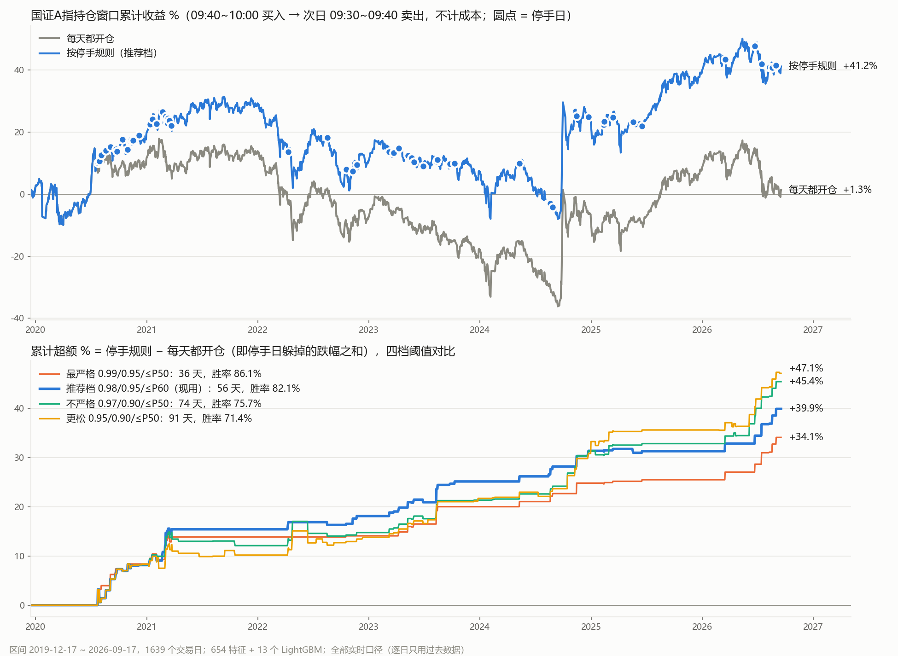

# 指数早盘风控（09:40 停手信号）· 说明与数据

本仓库公开方案说明与数据，**不含代码**。

每个交易日 **09:40**，用 13 个 LightGBM 模型加 1 个硬门控，判断“当日 09:40–10:00 买入国证A指、次日 09:30–09:40 卖出”这个持仓窗口是否处于极端危险状态。命中就当天不开仓（停手），每年约 8 天。

- **目标**：国证A指（SZ399317）买入价 = 当日 09:41–10:00 共 20 根 1 分钟收盘均价，卖出价 = 次日 09:31–09:40 共 10 根均价，y = 卖出价 ÷ 买入价 − 1
- **信息边界**：只用 t−1 日及以前的全量数据 + t 日 09:30–09:40 的分钟数据
- **特征**：654 个（指数与期指 1 分钟、全 A 个股 1 分钟主买主卖与委比、涨停生态与涨停细则、昨日状态、隔夜外盘、非线性组合）
- **模型**：13 个 LightGBM，4 个族（每天重训 / 分状态 / 全部特征 / 写死口径），扩展窗走步训练，没有固定的训练集 / 测试集切分，每天都是样本外
- **规则**：停手 = [“全部特征”或“写死口径”族分数 ≥ 0.98] 或 [“分状态”与“全部特征”族分数都 ≥ 0.95]，且昨日涨停股今晨委比的因果分位 ≤ 0.6

## 效果（2019-12-17 ~ 2026-09-17，1639 个交易日，全部实时口径）

| | 停手天数 | 每年 | 停手日指数下跌比例 | 平均跌幅 |
|---|---|---|---|---|
| 全区间 | 56 | 8.3 | 82.1%（90% 区间 73–89%） | −0.71% |
| 前段 2019-12 ~ 2022 | 28 | 9.2 | 78.6% | −0.65% |
| 后段 2023 ~ 2026-09 | 28 | 7.6 | 85.7% | −0.78% |

分块置换检验 p < 0.0001。按停手规则累计 +41.2%，每天都开仓 +1.3%（不计成本）。阈值、特征集、模型结构都是看过全样本后选定的，有挑选偏差，实盘预期约 76–80%。



## 文件

| 文件 | 内容 |
|---|---|
| `最终风控方案_说明文档.md` | 规则、效果、每个数据文件的来源、每组特征的算法、训练方式、未来函数审计结果 |
| `风控停手_累计超额.png` | 累计收益与四档阈值的累计超额 |
| [Releases](../../releases) → `riskcontrol` | 数据：3 个 zip 分卷 + `md5.txt` |

## 数据

在 [Releases](https://github.com/wsefcawefe/index-risk-0940/releases/tag/riskcontrol) 下载 `index_risk_data_part1of3.zip`、`part2of3`、`part3of3` 和 `md5.txt`，核对 md5 后把三个 zip 解压到同一个目录，得到：

```
data/
├── limit_list.parquet       涨停 / 跌停 / 炸板名单（tushare limit_list_d，2019-12 起）
├── daily.parquet            全 A 日线（tushare，2019-12 起）
├── daily_ext.parquet        全 A 日线（2016-01 ~ 2019-11）
├── stk_limit.parquet        涨跌停价
├── limit_up_full.parquet    收盘 = 涨停价的完整名单（含 ST）与连续涨停天数
├── ext_margin_fut.parquet   沪深融资余额、IC/IF 期货日线、上证换手率
├── ext_global.parquet       隔夜外盘指数日线
├── sw_l1.parquet            申万 2021 一级行业成分
├── idx_1m.parquet           10 个指数 + IF/IC/IH 1 分钟线（期货含主买主卖量与持仓）
├── ext_5m.parquet           期指 + 12 只港股大盘股 5 分钟线
├── index_5m*.parquet        指数 5 分钟线
├── m1_raw/YYYYMMDD.parquet  全 A 09:31–09:40 十根 1 分钟线：主动买入额、主动卖出额、委买、委卖
├── am_raw/YYYYMMDD.parquet  全 A 09:35–09:50 5 分钟线
├── flow_day/YYYYMMDD.parquet 全 A 全天累计主买额、主卖额
├── min5/、min5_extra/       昨日涨停股当日全天 5 分钟线
└── final/                   654 个特征表、因果分位表、13 个模型的逐日样本外分数、逐日决策
```

各文件的字段、来源接口和可用时点见说明文档第五节。`final/decisions.parquet` 里有每天的 4 个族分数、门控、R2、R3、停手标记和 y，可以直接复核上面的效果表。

## 未来函数审计（全部通过）

- **全链路截断重建**：把全部原始数据截到“截止日 09:40 能看到的样子”，从原始数据重算全部特征，在 3 个截止日逐格比对，0 格超出容差
- **未来投毒**：截止日之后的特征和标签换成噪声后重训 13 个模型，截止日及之前的分数与决策逐位相同
- **训练集边界**：训练集末日一律是预测日前 2 个交易日

审计过程中发现并修复的问题（包括一个汇率数据的未来函数）列在说明文档第九节。

## 免责

研究用途，不构成投资建议。原始行情数据来自天软与 tushare，使用前请确认你的数据授权。
